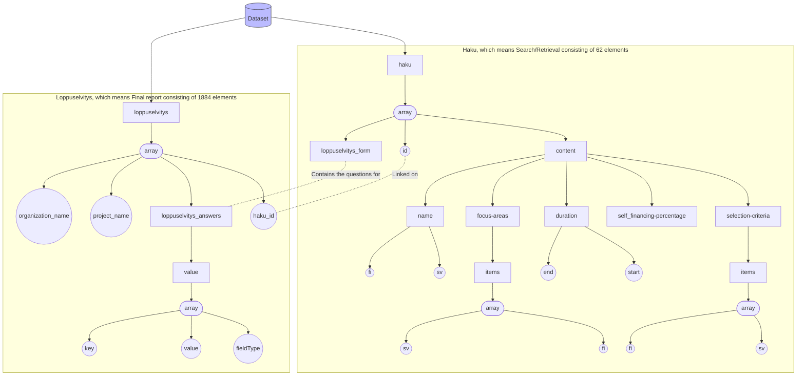

```mermaid
graph TD;
dataset[(Dataset)]-->loppuselvitys;
dataset[(Dataset)]-->haku;
style dataset fill:#bbf, stroke:#333


subgraph lop_subgraph [Loppuselvitys, which means Final report consisting of 1884 elements]
loppuselvitys--> lop([array]) ;

lop([array])-->loporgname((organization_name));
lop([array])-->lopprojectname((project_name));
lop([array])-->loppuselvitys_answers;
lop([array])-->lophaku((haku_id));
loppuselvitys_answers-->lop1[value];
lop1[value]-->lop1value([array]);
lop1value([array]) --> lopkey((key));
lop1value([array]) --> lopval((value));
lop1value([array]) --> lopft((fieldType));
end

subgraph haku_subraph [Haku, which means Search/Retrieval consisting of 62 elements]
haku --> hak([array]) --> hakid((id));
hak([array]) --> loppuselvitys_form;
hak([array]) --> content;

content --> name --> name_fi((fi));
name --> name_sv((sv));

content --> focus-areas --> content_items[items] --> item_array([array]);
item_array([array]) --> item_sv((sv));
item_array([array]) --> item_fi((fi));

content --> duration --> idend((end));
duration --> duration_start((start));

content --> self_financing-percentage;

content --> selection-criteria;
selection-criteria --> sel_item[items] --> selection_array([array]);

selection_array([array]) --> sel_fi((fi));
selection_array([array]) --> sel_sv((sv));
end	
hakid -.-|Linked on| lophaku;
loppuselvitys_form -.-|Contains the questions for| loppuselvitys_answers;
```